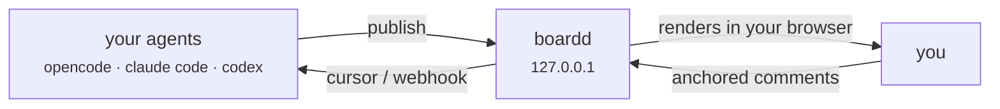

# board

**A shared board for you and your coding agents, running on your own machine.**

Your agent publishes a plan, a decision brief, a chart, or a set of questions to a board. You open it in a browser, and comment on the exact sentence, table row, or part of an image you mean. The agent reads those comments as structured feedback and carries on. No cloud, no accounts — a daemon on `127.0.0.1` and a folder in your home directory.



## What it's good for

A terminal agent's interface is one scrolling transcript. Three things go wrong there:

- **Decisions get buried.** The question that needed your answer scrolls off-screen behind subagent output. On a board it stays put, with a URL, until you answer it.
- **Context evaporates.** Discussing row 4 of a ten-row table means scrolling back to it. On a board you comment *on* row 4, and the agent gets the comment attached to it.
- **Text-only limits what an agent can show you.** The best explanation is usually a diagram, a table, or a chart. Boards render mermaid, math, tables, images, and agent HTML with live charts and click-through questions.

So: plans to approve, options to pick between, findings to react to, and questions an agent needs answered before it writes the wrong thing.

## Install

Linux is the supported platform. macOS is untested — session teardown reads `/proc`, and the systemd unit and UI auto-open are Linux-shaped.

You need [Bun](https://bun.sh) 1.4.x (`curl -fsSL https://bun.sh/install | bash`), git, and at least one agent harness — opencode, or claude code with the `claude` CLI on your PATH. Setup checks for bun and stops with the install line if it is missing; it never installs a toolchain for you.

```sh
git clone https://github.com/narragen/Board.git && cd Board
./scripts/setup.sh            # same as `make setup`
```

That builds dependencies, builds the web app, and wires the board tools into your agents — one token each, printed once and stored hashed, so **save them when they scroll past**. It deliberately **does not start a server**; you don't need one.

If a harness's CLI is missing, setup prints its manual wiring instead of failing. codex and pi always get a TOML snippet to paste.

## Try it

**Restart your agent session first** — MCP config loads at startup, so a session that is already running has the old one. Then say:

> spin up a board

The agent starts a throwaway board of its own, publishes to it, and hands you a link. A board opening in your browser means setup is done.

For more confidence first, `make smoke` runs a self-verifying 21-step loop — two agents and a human, on a temporary daemon and scratch ports, never touching your real data.

### Optional: a board library that outlives the task

Everything above needs no server. Start one for boards that **stick around** — browsable and reusable across tasks:

```sh
make serve     # foreground daemon on 127.0.0.1:7800
make open      # open the UI; if the board list loads, the stack works
```

For always-on, swap `make serve` for the systemd user unit in [docs/deployment.md](docs/deployment.md). Throwaway boards keep themselves as zip keepsakes when they end, and `make import` pulls one into the library.

## Configure

The four that matter; [docs/deployment.md](docs/deployment.md) is the full reference.

| | |
|---|---|
| **Your data** | Lives in `~/.board` — the database, event logs, and board bundles. Move it with `BOARD_DATA_DIR`. Agents never write there directly; every change goes through the daemon. |
| **The port** | `127.0.0.1:7800`, changed with `BOARD_PORT`. The loopback bind is a hard rule, not a default — never expose the daemon beyond your machine. `BOARD_HOST` is the documented opt-out for agents in Docker, and [docs/deployment.md](docs/deployment.md) has the rules that keep that safe. |
| **Agent tokens** | `make token add [name]` mints one (no name gets you a handle like `red-armadillo`), `make token list` shows them, `make token revoke <name>` kills one. Plaintext prints once and cannot be shown again. |
| **Your browser session** | Expires after 30 days. Run `make open` again. |

## Update

```sh
git pull && make setup
```

`make setup` is the update path as well as the install path — every step is safe to re-run. Two things to expect:

1. **It rotates your agent tokens.** The old ones are revoked and new plaintext prints once. It also refreshes the MCP wiring, which is why it is worth doing after a pull.
2. **Restart your agent sessions afterwards**, for the same reason as the first install.

Cheaper paths: `make install` alone updates the skills without touching credentials, and `make web` rebuilds just the UI.

## Read more

**If you're an agent working with boards**, `make setup` already copied both skills where your harness looks: [skills/board/SKILL.md](skills/board/SKILL.md) for the publish-and-consume loop, and [skills/interview/SKILL.md](skills/interview/SKILL.md) for asking a human questions they click answers into. `skills/templates/` has worked examples.

**If you're working on Board itself**, start at [AGENTS.md](AGENTS.md) — read order, commands, and the invariants that must not be broken.

| Reference | |
|---|---|
| [docs/api.md](docs/api.md) | Every REST route, MCP tool, and error code |
| [docs/feedback-grammar.md](docs/feedback-grammar.md) | How an agent consumes feedback: cursors, threads, webhooks |
| [docs/anchors.md](docs/anchors.md) | How a comment attaches to text, a row, or a region of an image |
| [docs/deployment.md](docs/deployment.md) | Install, systemd, Docker, backups, environment variables |
| [docs/architecture.md](docs/architecture.md) | Process model, board bundles, request flows, events |
| [docs/security.md](docs/security.md) | Threat model, what runs where, and why that's safe |
| [docs/decisions.md](docs/decisions.md) | Why things are the way they are |
| [docs/plan.md](docs/plan.md) | The approved plan, scope, and milestone status |
