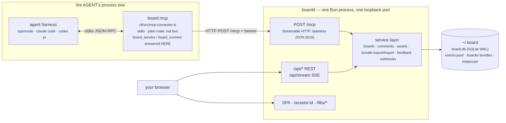
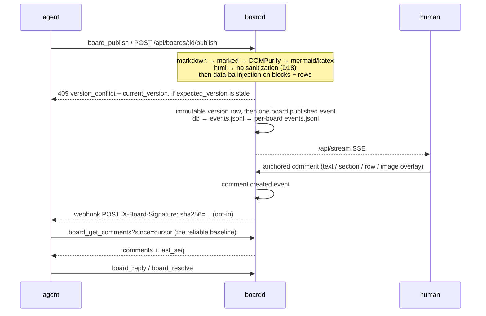
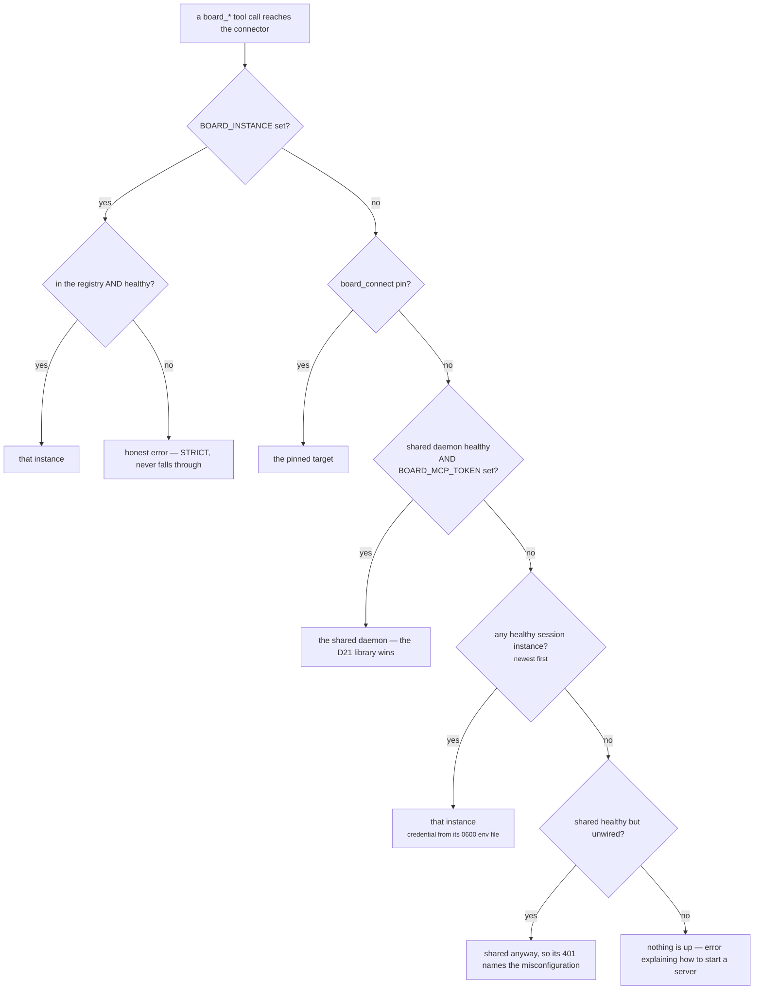

# Architecture

System design for v1. Scope and milestones live in [plan.md](plan.md); the threat model in [security.md](security.md).

## Orientation

One process serves everything — the SPA, `/api/*` REST, `/api/stream` SSE, `/mcp`, `/assets/:id`, and `/libs/*` on a single loopback port — with **one service layer** beneath both the REST routes and the MCP tools, so the event log cannot tell the two kinds of agent apart. The piece that surprises people is the connector: `board mcp` runs in the **agent's** process tree, not the daemon's, speaks stdio to the harness, and forwards JSON-RPC over HTTP to whichever daemon it resolves — which is why it must stay runnable under plain `node`. The loop is publish → event → SSE → anchored comment → event → webhook or cursor poll → reply/resolve, and nothing in it blocks (D3). Versions are immutable and `expected_version` is the concurrency control: a stale value is a 409 carrying `current_version`, never a silent overwrite. Everything durable lives under `~/.board` — SQLite is the queryable truth, the jsonl mirrors are the zero-dependency integration substrate, and each board bundle is one portable unit; session instances (D20) run this same design on an OS-temp dir instead.

### Process and ownership — who runs what



### The feedback loop



### Connector backend resolution

Five branches, in this order, evaluated per request and never cached (`cli/src/mcp-connector.ts`, `resolveBackend`). This diagram is the **single statement** of that precedence — every other mention in the doc set links here instead of paraphrasing it (D22, amended by D23 D4):



## Process model

One process — **`boardd`** is the daemon's name; `server/src/main.ts` is its entrypoint (`make serve` runs exactly that) — listens on one loopback port:

| Port | Serves |
|---|---|
| `127.0.0.1:7800` | React SPA, `/api/*` REST, `/api/stream` SSE, `/mcp` (Streamable HTTP), `/libs/*` vendored pinned libraries |

Every board — markdown and agent HTML — renders **in the host chrome** (D18): the two-origin iframe sandbox was built for M4, dogfooded one round, and removed by the owner's decision the same day. Agent HTML mounts into the app's DOM with scripts running; the host CSP (`connect-src 'self'`, `form-action 'self'`) is the guard. The trade and its accepted risks are recorded in [security.md](security.md) and [decisions.md](decisions.md) D18.

Ports are configurable (`BOARD_PORT`). The listener binds `BOARD_HOST`, `127.0.0.1` by default; `BOARD_BIND` does **not** add bind addresses — it is a **Host-header allowlist**, the extra `Host` names `assertAllowedHost` will accept, and it is the explicit, documented opt-in for Docker-hosted agents ([deployment.md](deployment.md) "Environment").

**Session instances (D20).** Alongside the always-on shared daemon, the CLI can spawn throwaway instances of the same single-process design: each is one `Bun.serve` process on its own OS-temp data dir and kernel-assigned loopback port (bind + Host allowlist pinned over the inherited env). The CLI (`board up`/`down`/`instances`) is the lifecycle owner — see [deployment.md](deployment.md) "Session instances". The shared daemon on `:7800` remains the MCP/always-on surface — the `/mcp` endpoint is unchanged — and since D22 agent harnesses reach MCP through a **local stdio connector** (`board mcp`, a client-side proxy in the agent's own process tree) that resolves a backend per request — the five-branch precedence in ["Connector backend resolution"](#connector-backend-resolution) above. No new REST routes were added for sessions.

## On disk

```
~/.board/                     BOARD_DATA_DIR (overridable)
  board.db                    SQLite (WAL): boards, versions, comments, events, tokens, subscribers
  events.jsonl                global append-only event log
  boards/<id>/                self-contained board bundle (a zip of this dir = full export)
    board.json                metadata snapshot
    versions/NNN.html         immutable documents (+ NNN.md source for markdown input)
    assets/<id>.<ext>         images, bundled with their board
    events.jsonl              per-board event channel
  instances/<id>/             session-instance registry (D20): instance.json (metadata, never tokens), env (0600 credential delivery), daemon.log, boards/ (zip keepsakes)
```

SQLite is the queryable source of truth; the bundle layout exists so a board is one portable, greppable unit. Export builds a self-contained zip from the db (manifest + version sources + comments + asset bytes + the board's event rows as an audit snapshot); import re-creates the board under a new id through the quarantine re-ingest ([security.md](security.md) "Import quarantine"). All writes flow through the daemon's API — agents never touch these files. The one CLI-owned exception is the session-instance registry (D20): `board up`/`down`/`instances` maintain `instances/<id>/` directly, while a session instance's own working data lives in an OS-temp dir for its short life.

## One document model

Every version is stored as **one HTML document** rendered in the host chrome. `format` (markdown | html) is input convenience:

- **markdown** → the daemon renders at publish (marked GFM → DOMPurify → mermaid strict → katex → Shiki highlighting), auto-injecting `data-ba` ids on every top-level block, heading, and table row. The derived document is script-free by construction (DOMPurify strips scripts). The markdown source is kept alongside the derived HTML.
- **html** → stored as an id-injected derived document (auto `data-ba` on unlabeled top-level blocks and rows; opt-in markers and labels kept, D18: no sanitization) and mounted into the app's DOM with head styles carried over and scripts re-created so they actually execute (`innerHTML` never runs script elements). Full hover/selection anchoring applies to every board.

## Request flows

**Agent publishes.** MCP tool or REST call (an MCP call first rides the agent-side D22 stdio connector — a client-side proxy that resolves a backend per request and forwards the JSON-RPC to it) → bearer auth (token → agent identity) → `format: markdown` rendered + anchors extracted → new immutable version row (`expected_version` mismatch → 409) → content mirrored into the bundle → event appended (db + global jsonl + per-board jsonl) → SSE broadcast → webhooks dispatched.

**Human comments.** Selection in the UI → anchor JSON (`section` / `text` with quoted original / `row` / `image` with overlay) → comment row (author, timestamp, thread parent) → event → agents receive it on their next cursor poll, event tail, or webhook.

**Agents consume.** Per-agent cursors (`workspace:agent`) return exactly the unacknowledged backlog; `GET /api/boards/:id/feedback` serializes unresolved threads as the feedback markdown grammar (human-readable, agent-parseable); presence is derived from real behavior — cursor reads and webhook registrations (D19: SSE connections are delivery only, never presence) — not from heartbeats agents must remember to send.

**MCP (agents, first-class).** `POST /mcp` on the host port speaks Streamable HTTP in stateless JSON mode (D16): every request gets a fresh MCP server + transport (no sessions, no GET SSE stream; non-POST → 405), auth is agent-token-only (header or `?token=`; valid human session tokens are rejected), and every tool calls the same service-layer functions the REST routes call — MCP agents and REST agents are indistinguishable in the event log. Parity is exact in that direction; it is not symmetric: `board_status` is **MCP-only** (a daemon-liveness roll-up with no REST counterpart, D14), and `board_servers`/`board_connect` never reach the daemon at all. What an agent harness actually spawns is the D22 **local stdio connector** (`board mcp` / `node cli/src/mcp-connector.ts`): it answers `initialize`/`ping` and lists the tools from the shared manifest — its own 13 proxied tools plus the two D23-D4 connector-local ones (`board_servers`/`board_connect`, handled locally, never proxied) — then proxies everything else to the resolved backend's `/mcp`, chosen by the five-branch precedence in ["Connector backend resolution"](#connector-backend-resolution) above. The endpoint below is unchanged by that. The tool surface is defined in [plan.md](plan.md); feedback consumption is one path (D15): `board_get_comments` + `since` cursor.

**Webhook delivery.** `POST /api/boards/:id/subscribe` (or the `board_subscribe` MCP tool) registers one webhook per principal per board — re-subscribing replaces it — and appends an `agent.subscribed` event whose seq stamps the subscription record. Every later event on the board is POSTed to each subscriber's URL as the event envelope (`{seq, ts, actor, type, board_id, payload}`); with a `webhook_secret` the delivery carries `X-Board-Signature: sha256=<hex>` (HMAC-SHA256 over the exact request body), without one it goes unsigned. Deliveries are fire-and-forget — an event append or API call never waits on one — but serialized per subscription so a slow endpoint can't reorder its stream. A delivery has 3 attempts (exponential backoff, 500ms → 2s); non-2xx or a network error is a failure, and the final failure appends a `webhook.failed` dead-letter event to the global + board logs (the dispatcher never delivers `webhook.failed` — it is an audit marker, and skipping it is what breaks the fail-about-a-failure loop). `GET /api/boards/:id/subscribers` merges the webhook registry with the auto-detected cursor presence rows (D19).

**Asset ingest + serving.** `POST /api/assets` accepts a binary image body (board scoped via `?board_id=`) or a JSON `{board_id, path}` file-copy from the daemon's host — the same path the `board_upload_image` MCP tool uses. Both variants funnel through one verification pipeline (mime allowlist → magic bytes → size caps; SVG parse-and-sanitized at ingest — [security.md](security.md) "Assets"), then the file lands in the board bundle (`boards/<id>/assets/<asset_id>.<ext>`), an `assets` index row is written, and an `asset.added` event is appended like any other. `GET /assets/:id` serves the stored bytes **without bearer auth** (img elements cannot send Authorization headers) with the content-type pinned from the stored mime and immutable caching; the asset-id shape keeps the SPA's hashed vite bundles (also under `/assets/*`) falling through to static serving. Markdown embeds are rewritten at publish — `` becomes `">` before DOMPurify; an `asset:` src whose id fails the shared shortId shape fails the publish with **400 `invalid_asset_embed`** naming the offending src (a board that silently loses its images falsifies the document — the agent retries with a fix), while shape-valid unknown ids still publish and 404 at serve time; html boards reference `/assets/<id>` directly (D18).

**Bundle export/import.** `GET /api/boards/:id/export` (bearer-authed, works on ended boards) zips a self-contained bundle: `manifest.json` (schema version, board meta, version index, comment count summary, asset index), `content/<n>.<md|html>` per version (SOURCE content — markdown source for markdown versions, the id-injected document for html versions), `comments.json` (all comments with anchors, threading, resolve state, timestamps), `assets/<id>.<ext>` + meta, and `events.jsonl` (the board's event rows verbatim — an audit snapshot only). `POST /api/boards/import` takes the raw zip and always mints a NEW board id: every version re-renders through the publish pipeline (markdown through DOMPurify again, html re-derived with fresh anchor injection), every asset re-verifies through the ingest pipeline and gets a new id (embeds and `src` references remapped before publish), comments replay as data with fresh ids onto fresh events (an initial `board.imported` notes the source board + counts), and the bundle's own events are never replayed into the live log. Unknown schema versions, zip-slip entries, and anything that fails re-render or re-verification are a 422 naming the item, with nothing written — the details are [security.md](security.md) "Import quarantine". The `board_export` MCP tool returns the same bundle base64-encoded (8 MB cap — bigger boards use the REST route).

## Events

Global monotonic `seq`; every mutation is one event: `board.created/imported/published/ended/restored`, `comment.created/replied/resolved`, `asset.added`, `agent.subscribed`, `webhook.failed`, … Events are append-only (an invariant) and the audit view is a filter over them.

**Audit view (M7).** The web UI's audit view polls `GET /api/events` — a pure read over the events table with `board_id`, `type` (exact match; `type=webhook.failed` is the promised dead-letter view), `since`, and `limit` filters (default 100, clamped to 500), pages oldest-first so `since=<last shown>` pages forward, and `last_seq` carrying the GLOBAL max seq as the next-poll cursor. Any authenticated principal may read it (agents already hold the log via the jsonl mirrors and cursors — no new exposure), while the operator panels are human-session-only with agent bearers 403'd as recon (the mirror of MCP's D16 human-rejection): `GET /api/sessions` + `DELETE /api/sessions/:id` (revocation — the remediation for a dogfooded session-token leak; a sessions-table write, never an event) and `GET /api/tokens` (names + lifecycle only, never values or hashes). The UI polls rather than streams: the global `/api/stream` SSE already delivers an unfiltered live tail if one is wanted.

Delivery is layered:

| Channel | For | Guarantee |
|---|---|---|
| SSE (`/api/stream`) | the web UI, agents that want push | best-effort; reconnect resumes via last seq |
| `?since=` cursor polling | agents (the reliable baseline) | at-least-once, restart-safe |
| `events.jsonl` tails | hook systems (Claude `FileChanged`, opencode plugin events), scripts | plain file, zero client library |
| HMAC-signed webhooks | opt-in push per subscriber | 3 retries, backoff, dead-letter events on failure |

## Versioning & conflicts

Versions are immutable and numbered per board. Publishing takes `expected_version`; a stale value returns 409 so two agents can't silently clobber each other (open-artifacts' model). "Restore" publishes a copy of an old version as a new one — history stays linear and honest; nothing is ever mutated in place.

## Multi-agent notes

Every publish/comment/event carries an actor (the human, or a named agent via its token). Agents in different worktrees/processes all talk to the same daemon. Docker-hosted agents can't reach host loopback by default — the supported forms are in [deployment.md](deployment.md) ("The loopback tension — read before you run"): run with `--network host`, publish as `-p 127.0.0.1:7800:7800` with `BOARD_HOST=0.0.0.0` inside the container, add the agent's hostname to `BOARD_BIND` so its `Host` header passes the allowlist, or volume-mount `~/.board` and tail per-board `events.jsonl` from inside the container.
